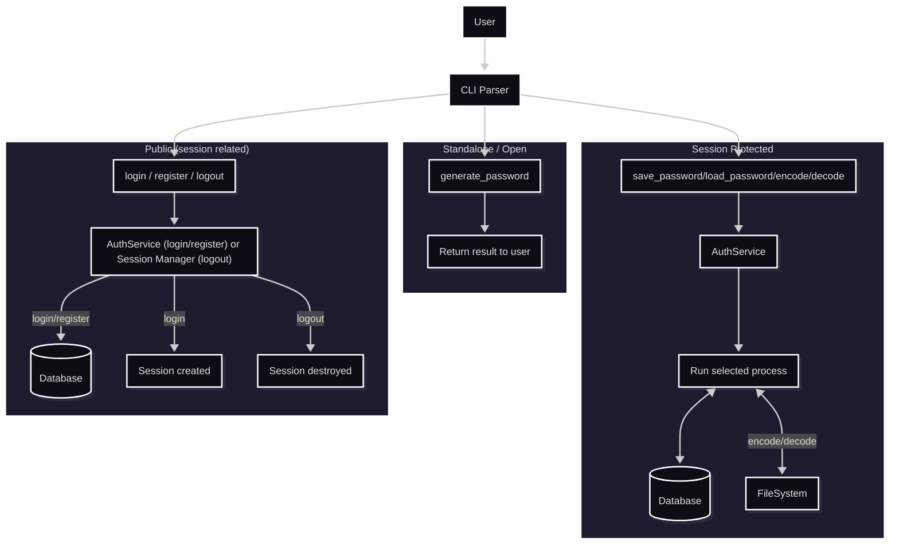

```mermaid
---
config:
  look: neo
  theme: redux-dark
  layout: dagre
---
flowchart TD
    subgraph Session["Session Protected"]
        H["save_password/load_password/encode/decode"]
        I["AuthService"]
        J["Run selected process"]
        K[("Database")]
        L["FileSystem"]
    end
    subgraph subGraph1["Standalone / Open"]
        X["generate_password"]
        Y["Return result to user"]
    end
    subgraph Public["Public (session related)"]
        C["login / register / logout"]
        D["AuthService (login/register) or Session Manager (logout)"]
        E[("Database")]
        F["Session created"]
        G["Session destroyed"]
    end
    A["User"] --> B["CLI Parser"]
    B --> H & X & C
    X --> Y
    C --> D
    D -- login/register --> E
    D -- login --> F
    D -- logout --> G
    H --> I --> J
    J <--> K
    J <-- encode/decode --> L


```